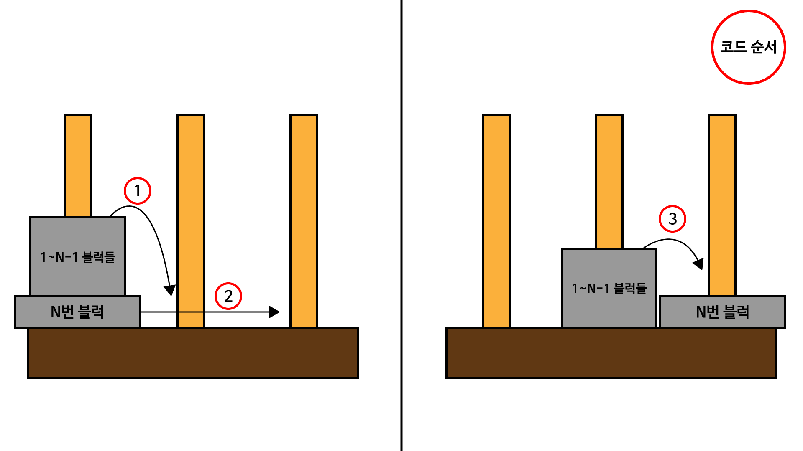

# 1914. 하노이 탑

> 하노이 탑의 이동 순서와 이동 횟수를 출력한다.


## 내 생각

재귀 함수 문제 풀이의 대표적인 문제로 재귀를 이해하는데 가장 도움이 됐던 문제다 !

`일단 하노이탑 게임의 조건으로 자신보다 작은 블럭이 자신이 존재한 기둥 위치의 밑에 존재해서는 안된다!`

문제 풀이에서 생각해야했던 가장 중요한 점은 규칙을 찾지말고, 블럭 하나가 이동하기 위해서는 자신의 위에 존재하는 블럭들을 내가 가고자 하는 기둥이 아닌 다른 하나의 기둥에 전부 위치시킨다는 것이다.

**`규칙을 찾지 않는다.. 재귀 함수가 알아서 다 해줄 것이다..`**


- 풀이 이미지 표현



## 코드

```python
def hanoi(fr, by, to, current):
    if current == 1:
        # 가장 작은 블럭
        print(fr, to)
    else:
        # 위에 블럭들 다 치워
        hanoi(fr, to, by, current-1)
        # 이제 나 이동하자..
        print(fr, to)
        # 나 이동했으니까 다시 블럭들 내 위로 올라와
        hanoi(by, fr, to, current-1)


# N = 원판의 개수
N = int(input())

# 이동 리스트
lst = []
count = 0

print(2**N-1)
if N <= 20:
    hanoi(1, 2, 3, N)
```


