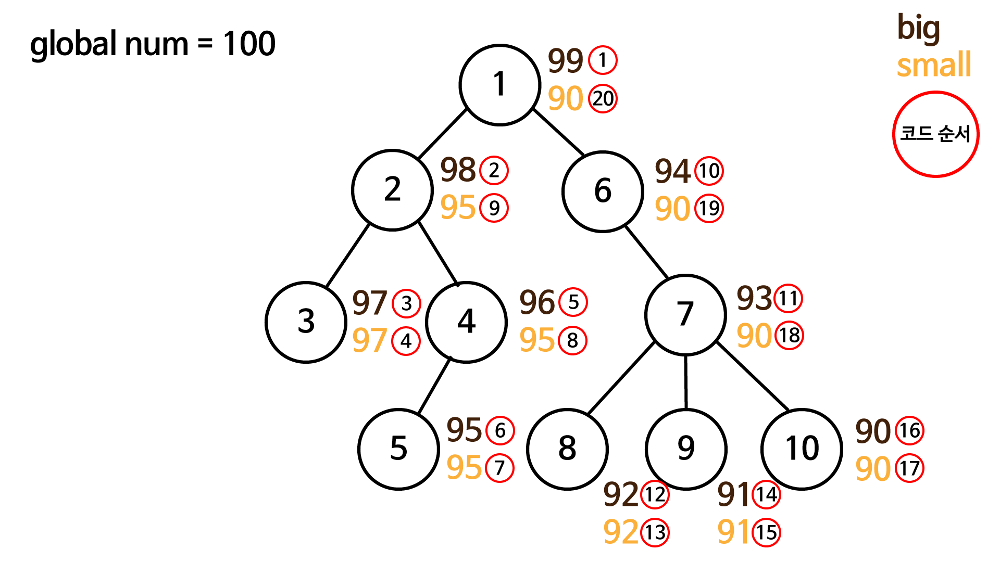

# 1248. 공통조상 찾기

> 정점과 간선의 정보와 두개의 노드가 주어질 때 두 노드의 공통되는 조상과 해당 조상의 sub tree의 크기를 출력하라


## 내 생각

문제를 처음보고 풀이 방법이 여러개 생각났다.

첫 번째 풀이 방법은 두 노드의 최고 조상으로 부터 거리를 구하고 조금 씩 좁혀가면서 공통 조상을 찾은 후, 그 조상으로 부터 `dfs`를 통해 sub tree의 크기를 구한다!

그런데 이 풀이 방법은 `두 번의 탐색이 일어나야 하기 때문에 조금은 비효율적이지 않을까?.. 배열 하나를 만들어서 두 개의 정보를 다 얻을 수 있는 방법이 있지 않을까?` 라고 생각했다. 

그래서 tree와 dfs의 특성을 이용한 방법을 통해 하나의 배열을 만들고 두 가지 정보를 모두 얻는 방법으로 풀이를 진행했다.

일단 dfs는 깊이 우선 탐색으로 엄마의 노드가 탐색이 종료되기 위해서는 자식의 노드들이 모두 탐색이 끝나야 한다. 이 점을 이용해서 풀이를 진행했다.

정점의 개수는 10000개 이하라고 문제에서 지정했기 때문에 초기에 10001이라는 숫자를 전역 변수에 선언하고 **`노드가 탐색 될 때마다 그 숫자를 하나씩 빼주면서 각 노드가 실행될 때마다 big과 자식 노드 탐색까지 모두 종료되면 small 변수에 각각 전역 변수의 값을 넣어주고 배열에 append 시켰다.`**

이렇게 풀이하게 되면 각 노드의 `big-small+1` 을 하게 되면 해당 노드의 sub tree의 크기를 구할 수 있다!

또한 중요한 점 하나는 **`어떤 노드(이하 1)의 big >= 다른 하나(이하 2)의 노드의 big && 어떤 노드의 small <= 다른 하나의 노드의 small`**이라는 조건을 만족하면 1노드는 2노드의 부모 노드라는 것이 만족된다. 이 점을 이용해서 주어진 두 개의 노드의 공통 조상 노드 번호를 알 수 있었다.


- 풀이 이미지 표현




## 코드

- big, small 테이블 만들기

```python
def makeTable(current):
    global num
    num -= 1
    parents = num
    arr[current].append(parents)

    # 자식을 모두 탐색
    for i in range(len(my_son[current])):
        makeTable(my_son[current][i])
        
    arr[current].append(num)
```


- big, small table을 이용해서 공통 조상과, 공통 조상의 sub tree 크기 구하기

```python
# my_mom 배열은 해당 인덱스의 부모 노드의 번호가 담겨있다.
current = my_mom[node1]
    result = 0

    while True:
        if arr[current][0] >= arr[node2][0] and arr[current][1] <= arr[node2][1]:
            result = current
            break
        current = my_mom[current]

    num_sub = arr[result][0] - arr[result][1] + 1
```

